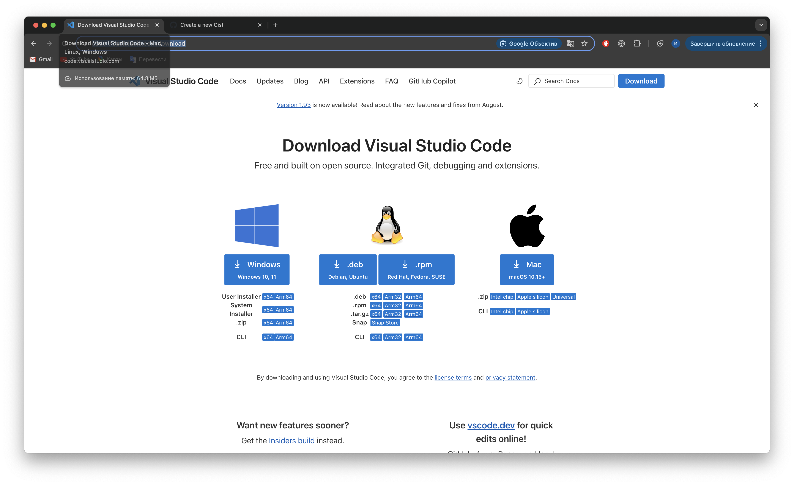
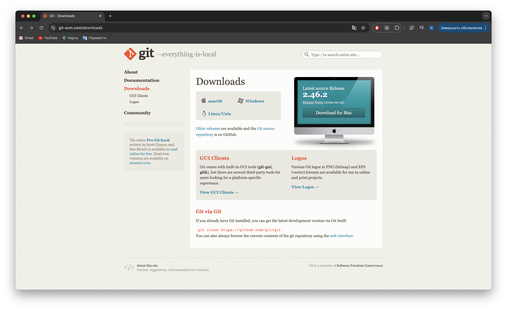
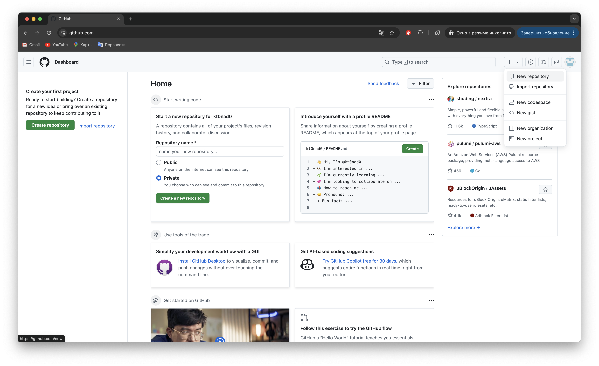
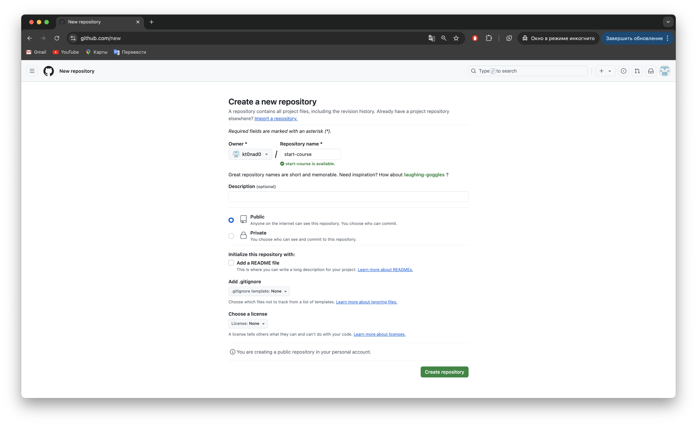
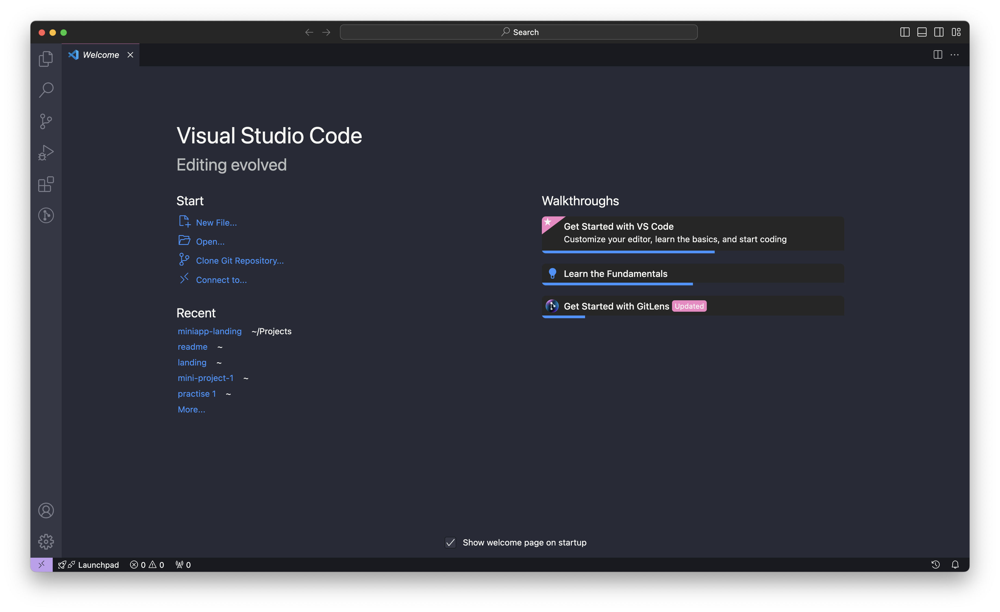
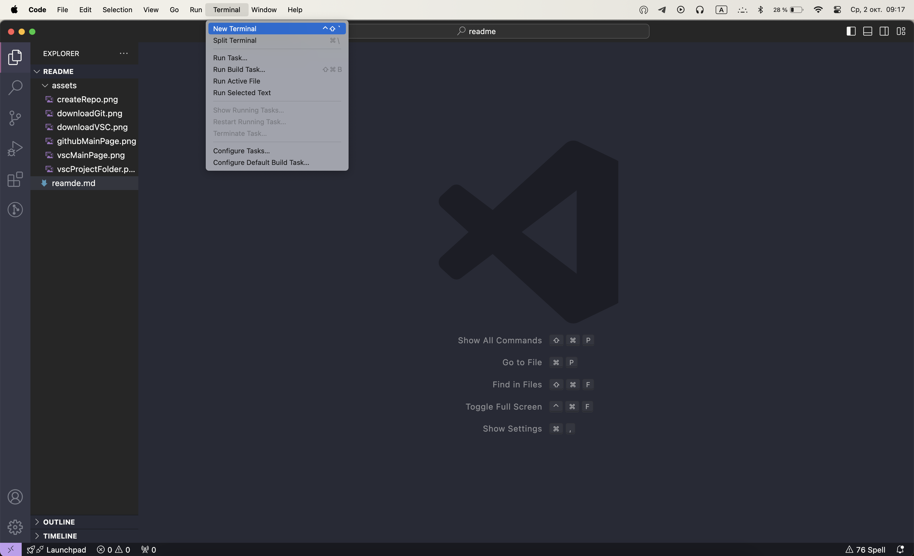
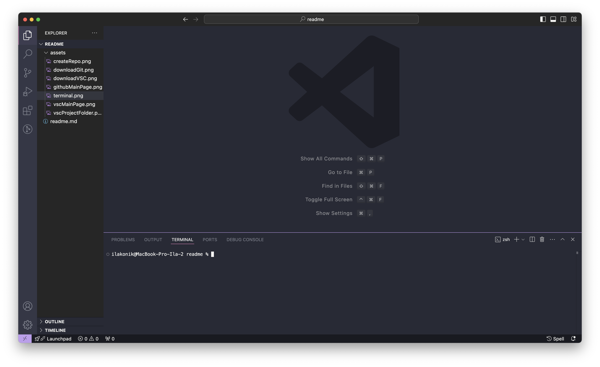

# Установка Visual Studio Code

- Переходите по ссылке https://code.visualstudio.com/download:

- Выбирайте версию, подходящую вашей операционной системе;
- Скачивайте и устанавливайте;

# Установка Git

- Переходите по ссылке https://git-scm.com/downloads:

- Выбирайте версию, подходящую вашей операционной системе;
- Скачивайте и устанавливайте;
- Во время установки будет предложено выбрать программу, с которой использовать git по умолчанию. Выберите Visual Studio Code;
- После установки Git закройте и откройте Visual Studio Code, если он был открыт;

# Как заливать свои файлы на Github

- Зарегистрируйтесь на Github https://github.com/
- После авторизации перейдите на главную страницу https://github.com/, справа сверху выбираем "New repository":

- На странице создания репозитория заполняем поле с названием репозитория и нажимаем на кнопку "Create repository" справа снизу:

- Открываем Visual Studio Code, нажимаем на кнопку "Open" и выбираем папку, в которой лежат файлы, которые мы хотим залить на Github:

- Сверху нажимаем на кнопку "Terminal" и выбираем "New terminal":

- В открывшемся снизу окне с терминалом:

- Последовательно вводим следующие команды для того, чтобы залить ваши файлы в ваш репозиторий (замените <Имя пользователя> и <Название репозитория> на ваши):
```
git init
git add .
git commit -m "first commit"
git branch -M main
git remote add origin https://github.com/<Имя пользователя>/<Название репозитория>.git
```